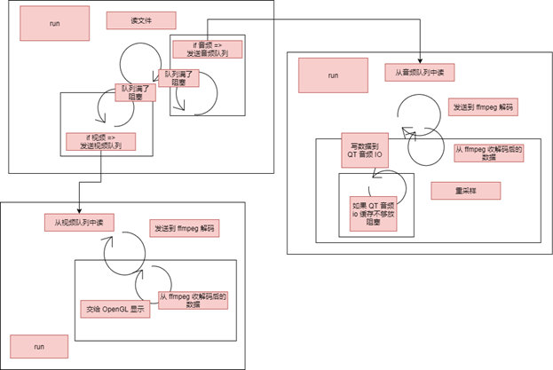
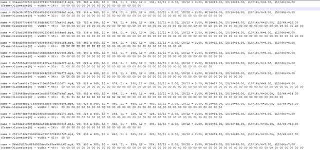

## FFmpeg/QT/OpenGL 简易视频播放器

此项目是学校 Cpp 课程实践大作业

## 主要功能

- 视频打开播放
- 音视频同步
- 视频暂停、继续播放
- 视频进度拖放
- 视频全屏

## UML类图


## 开始播放部分流程示意图


## 值得注意的点

### 音视频同步

因为视频封装格式的问题，视频数据靠前，所以视频将先读取到队列中，然后再读取音频，之后音频开始输出，逐渐超过视频视频就开始播放，然后视频又超过音频就继续等待。

```c++
if (&& synpts < decode->pts)
{
    vmux.unlock();
    msleep(1);
    continue;
}
```

### 视频音频队列

因为视频文件封装格式千差万别，而大多数都不满足视频数据和音频数据相邻放置，所以需要一定的缓存队列。



### YUV420P -> RGB

R= Y+ 1.4075 * (V-128);

G = Y-0.3455 * (U-128) - 0.71 69 * (V-128);

B =Y+1.779 * (U-128);

因为原始视频数据特别大，而且GPU的浮点运算能力特别高，所以使用着色器语言来进行编写并在GPU上运行。

```glsl
varying vec2 textureOut;
uniform sampler2D tex_y;
uniform sampler2D tex_u;
uniform sampler2D tex_v;
void main(void)
{
    vec3 yuv;
    vec3 rgb;
    yuv.x = texture2D(tex_y, textureOut).r;
    yuv.y = texture2D(tex_u, textureOut).r - 0.5;
    yuv.z = texture2D(tex_v, textureOut).r - 0.5;
    rgb = mat3(1.0, 1.0, 1.0,
        0.0, -0.39465, 2.03211,
        1.13983, -0.58060, 0.0) * yuv;
    gl_FragColor = vec4(rgb, 1.0);
}
```

### 视频数据对齐



因为行数据并有些时候并不是完整的宽度，所以我们只拷贝有用的数据来，使用 for 循环，每次只拷贝行宽度的数据。

```c++
if (width == frame->linesize[0])
{
    memcpy(datas[0], frame->data[0], width*height);
    memcpy(datas[1], frame->data[1], width*height / 4);
    memcpy(datas[2], frame->data[2], width*height / 4);
}
else
{
    for (int i = 0; i < height; i++) //Y 
        memcpy(datas[0] + width * i, frame->data[0] + frame->linesize[0] * i, width);
    for (int i = 0; i < height / 2; i++) //U
        memcpy(datas[1] + width / 2 * i, frame->data[1] + frame->linesize[1] * i, width);
    for (int i = 0; i < height / 2; i++) //V
        memcpy(datas[2] + width / 2 * i, frame->data[2] + frame->linesize[2] * i, width);

}
```

